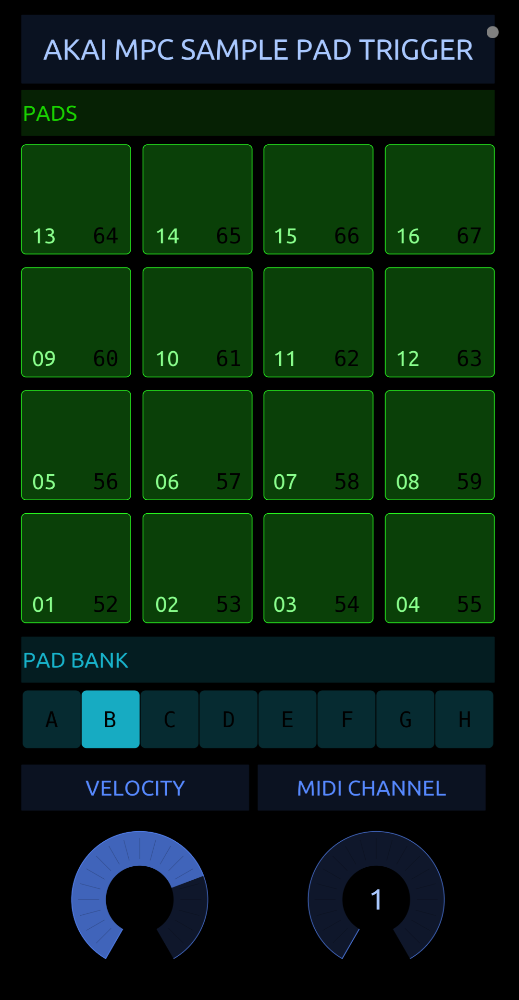

# MPC Sample Resampling Buddy
Touch OSC utility to trigger the sample pads on Akai MPC Sample.

This *may* be something Akai fix in future firmware updates but until then...this...

## Rationale

This came about when trying to resample individual pads with effects etc. As an MPC Sample user you'll know that once you engage sampling (resampling) by selecting the destination pad, you can no longer tap a single pad to resample a single sound, instead you have to play the current sequence or (which also works pretty well) use the Sample Recall function and just trim your individual sample out of the 25 second buffer.

I figured out that while you can't physically trigger a single pad on the unit to resample it, you CAN trigger the pad via MIDI.

I then got to thinking - what's the simplest, most convenient way to trigger a single pad via external MIDI. So I hooked up my Android phone via USB-C (MIDI) and created this Touch OSC project. MPC Sample Resampling Buddy

## MPC Sample Resampling Buddy

MPC Sample Resampling Buddy is a Touch OSC project that can send MIDI triggers to the MPC Sample to trigger the samples assigned to it's pads.

You can select the Pad Bank and also set the velocity that the sample will be triggered at. You can also set the MIDI channel if you have your MPC Sample set to a specific channel (the MPC Sample defaults to 'All' so will receive on any channel).

### Requirements

* Touch OSC
* A MIDI device to send MIDI to the MPC Sample
* A cable to connect the MIDI device to MPC Sample
* MPC Sample

### Instructions

How you get the project *into* Touch OSC very much depends on your platform and devices. If you have Touch OSC I imagine this is not a problem for you. Combinations of hardware and software are so myriad that I refuse to get into giving you instructions. If you get really, REALLY stuck, drop me a line info@marmotaudio.co.uk

1) Connect your MPC Sample to your computer/tablet/phone in a way that you can send MIDI data from the device to your MPC Sample
2) In the "Link/Connection" setup, select MIDI and set up a new connection for your MPC Sample
3) Load my MPC Sample Helper project and switch to use mode (or play mode or whatever not-edit mode is)

From here:

* the pads should be self explanatory - they mimic the MPC Sample pad layout
* Select the Pad Bank with the Pad Bank selector
* Select the MIDI channel with the MIDI Channel dial
* Set the trigger velocity with the Velocity dial

Tap the pads!

### Utility

#### MIDI Learn

Tap the [MIDI LEARN] button to enable/disable MIDI learning. It's not MIDI learn in the traditional sense. What it does is cause Resampling Buddy to monitor the pads as you tap them on the MPC Sample (as long as you have MIDI Out enabled and have PAD Midi Out turned on). The last pad you tapped on the MPC will be highted on Resampling Buddy (and the Pad Bank selection will also change to reflect what bank is currently selected when you tap a pad on the MPC).

The idea behind this is that as you are playing pads to audition the sample you want to resample, the pad will already be highlighted on Resampling Buddy so just engage Sample Record, select the destination pad and hit the highlighted pad on Resampling Buddy. Perfect!

